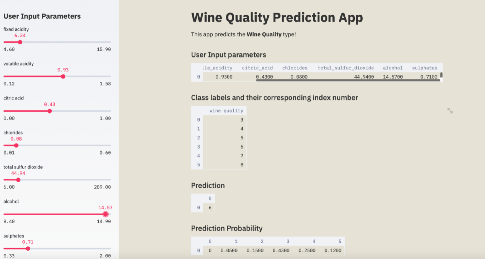

#  Wine Quality Prediction App

#### Project Overview

##### Introduction

Wine is an alcoholic beverage made from fermented grapes. Yeast consumes the sugar in the grapes and converts it to ethanol, carbon dioxide, and heat. It is a pleasant tasting alcoholic beverage, loved cellebrated . It will definitely be interesting to analyze the physicochemical attributes of wine and understand their relationships and significance with wine quality and types classifications. To do this, We will proceed according to the standard Machine Learning and data mining workflow models like the CRISP-DM model and devlop an app mainly for:

Predict the quality of each wine sample, which can be low, medium, or high.
The data science workflow is a non-linear and iterative task which requires many skills and tools to cover the whole process. From framing your business problem to generating actionable insights. It includes following steps
1. Business Understanding
2. Data Collection
3. Data Preparation
4. Exploratory Data Analysis
5. Modeling
6. Model evaluation
7. Deployment

Sometime its very tiresome to spend time on a web framework after investing so many hours on a data science project. Streamlit takes care of deployment and which can be published as working web application. 
Here I am going to make a simple machin learning with the help of Streamlit to predict wine quality from 3 to 8(as in dataset).

#### Project Goals

Use machine learning to determine which physiochemical properties make a wine 'good' and devlop a web app with the help of streamlit to predict quality of wine?

#### Data Overview

Dataset is from Kaggle. This datasets is related to red variants of the Portuguese "Vinho Verde" wine.Vinho verde is a unique product from the Minho (northwest) region of Portugal. Medium in alcohol, is it particularly appreciated due to its freshness (specially in the summer). The classes are ordered and not balanced (e.g. there are much more normal wines than excellent or poor ones).
##### Attributes Information

Input variables (based on physicochemical tests):
1. fixed acidity 
2. volatile acidity 
3. citric acid 
4. residual sugar 
5. chlorides 
6. free sulfur dioxide 
7. total sulfur dioxide 
8. density 
9. pH 
10. sulphates 
11 .alcohol 
Output variable (based on sensory data): 
12. quality (score between 3 to 8)

##### App Deployment
App is deployed as app1.py in streamlit. 
streamlit run app1.py  
After few seconds, an internet browser window should pop-up and directs you to the created web app by taking you to http://localhost:8501 as shown below.

